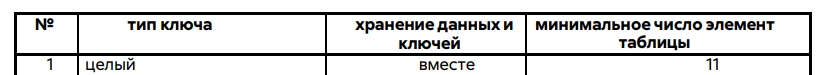

метод пузырька

Коллеги, в итоге меня поправили старшие коллеги

Читаем из файла всегда так
<Число строк>
key
<string>
key
<string>

Если храним вместе, то...
|key, value|key, value|key, value|...
Так должны быть представлены данные в коде (ключ хранится рядом со строкой)

Если храним раздельно
|key|key|key|

|value|value|value|
То в коде хранятся разделно (разными массивами)
И связаны друг с другом как-то (указатели или индексы например)

надо читать файл до eof и n в сортировке должна быть длинной массива пополам
